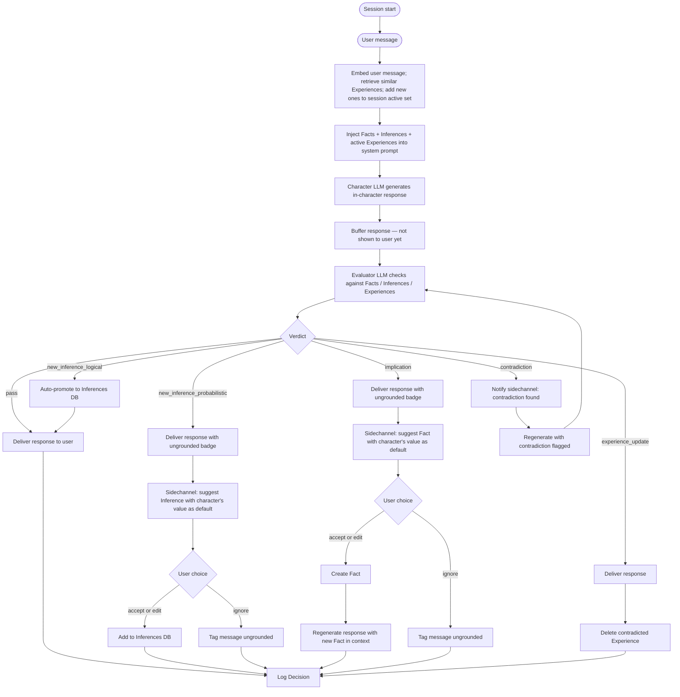
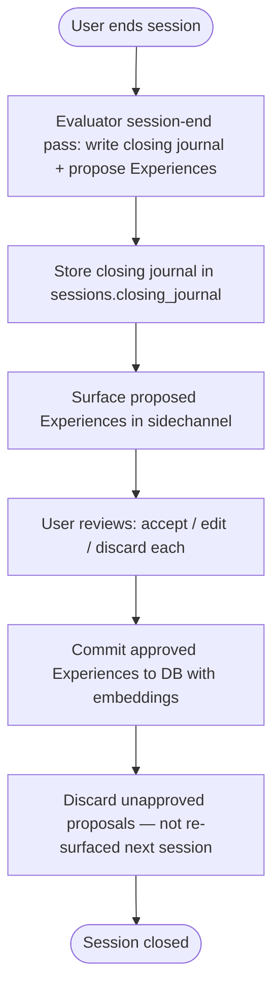
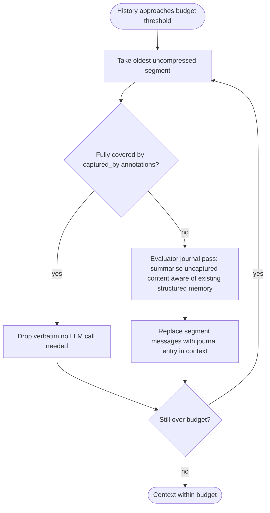
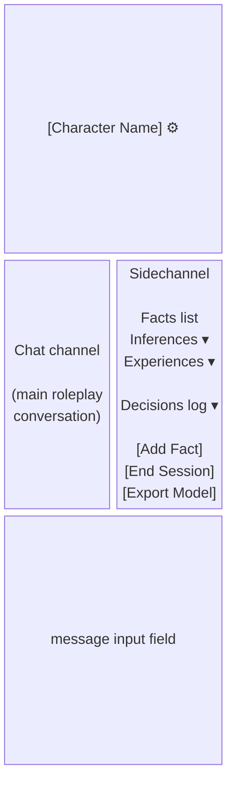

A locally-hosted, web-based chatbot designed for character development and roleplay. Unlike general-purpose chatbots, it maintains a structured, auditable memory modelled loosely on how a D&D character sheet works, grounding the character's behaviour in explicit, user-defined facts rather than letting the model invent its own.
## Core Concept
The problem with using a raw LLM for character roleplay is that models hallucinate details freely. Ask a character what their mother's name is and it'll make one up confidently, then forget it ten turns later and make up a different one. This project treats that as a design flaw to fix, not a quirk to live with.

**The solution:** structured memory with four distinct tiers, enforced by a second LLM acting as a critic/evaluator.
## Memory Model
### Facts
Ground truths about the character. Set by the user, never by the model.
- **Immutable from the character's perspective**: the model cannot assert or imply a value that contradicts an established Fact, and cannot invent Facts to fill gaps
- **Editable by the user**: the user is the author and may add, edit, or delete Facts at any time
  - *Edit*: triggers revalidation of all Inferences that reference the changed Fact — the evaluator is re-invoked for each downstream Inference to determine whether it still holds under the new value. Those that don't are marked `stale` and surfaced to the user
  - *Delete*: all Inferences referencing the deleted Fact are marked `invalidated` and surfaced to the user for review
- If a user's prompt requires a Fact that doesn't exist yet, the character may invent a value, but the evaluator will surface it to the user for approval. The user can accept the character's suggested value or override it with their own. If overridden, the response is regenerated with the user-provided Fact in context.
- Examples: name, age, height, place of birth, occupation, relationship status, details of appearance, etc.
### Inferences
Logical conclusions derived from established Facts and/or other Inferences. Never invented; always traceable through a derivation graph back to root Facts. Generated two ways:

**Eager generation:** when a new Fact is added or edited, a dedicated LLM pass derives all conclusions the current Fact and Inference set can support. Runs upfront so the character starts each session with a coherent baseline.

**Lazy discovery:** during roleplay, the evaluator may find the character asserting something not yet stored as an Inference but derivable from existing Facts or Inferences. These are promoted to the Inferences store in real time. Lazy discovery does **not** trigger a new eager pass — that would risk a derivation chain reaction. The newly promoted Inference is available immediately; additional downstream derivations are deferred to the next explicit eager pass (triggered by the next Fact edit or addition).

Two inference types with different behaviour:
- **Logical**: derivable by pure reasoning with no hidden assumptions. Birth year from age + current year; required education from stated occupation. Auto-promoted silently and logged — no user prompt needed.
- **Probabilistic**: likely but not certain; requires an assumption beyond what the sources strictly support. Surfaced to the user with the character's asserted value as default (accept / edit / ignore), the same way an implication is handled.

**Chaining:** Inferences can derive from other Inferences, enabling natural reasoning chains:
- Fact: `age=33`, `current_year=2026` → Inference (depth 1): `born in 1993`
- Inference: `born in 1993` → Inference (depth 2): `was a teenager during 9/11`

Two runaway risks, controlled separately:
- **Depth** (Inference-on-Inference chains): a configured max depth caps how many hops the eager pass will follow from root Facts. Inferences that would exceed this depth are not stored. Default: **5**; configurable. The same cap applies to lazy discovery — if a discovered Inference would exceed the max depth it is silently discarded.
- **Breadth** (fan-out from a single Fact): the eager pass is instructed to derive only what is *directly and certainly* supported — not to speculate — and outputs are count-capped per pass. Default: **5** Inferences per pass; configurable.
- **Cycles** (Inference A ← Inference B ← Inference A): prevented by cycle detection at write time. When a new Inference is added, the derivation graph is checked for cycles via topological sort; circular derivations are rejected.

**Cascade effects when Facts change:**
- *Fact edited*: Inferences referencing it via `source_fact_ids` are revalidated by re-invoking the evaluator for each one; those that no longer hold are marked `stale` and surfaced to the user. Downstream Inferences (those that derived from the now-stale Inference) are also revalidated transitively.
- *Fact deleted*: all Inferences referencing it — directly or transitively — are marked `invalidated` and surfaced to the user: keep, rewrite against remaining Facts/Inferences, or delete.
### Experiences
Things the character has learned through conversation — not established by the user in advance, but discovered through interaction. The character's episodic memory.

- Generated by the evaluator at the **end of each session** via a retrospective pass over the full conversation
- Proposed to the user for approval before being committed — each proposed Experience can be accepted, edited, or discarded; unapproved proposals are held in backend state during the review flow and are never written to the database
- Stored with a source annotation: *told by user* (reliable, explicit) or *observed in conversation* (softer, inferred from behaviour)
- Retrieved **per turn** by embedding the current user message and querying for semantically similar Experiences — not injected in full, and not retrieved once at session start. Retrieval returns a fixed top-k result set; default **k=5**, configurable.
- **Accumulation within a session**: once an Experience is retrieved it is added to the session's active set and stays in context for the remainder of the session. The active set only grows; it never shrinks mid-session. This prevents the character from "forgetting" something it already recalled.
- **Cold start** (first turn of a new session, before any user message): the closing journal entry from the previous session (see *End-of-session flow*) is embedded and used as the retrieval query, so the character resumes with continuity rather than a blank slate.
- **Invalidation**: the evaluator detects when a character response contradicts an active Experience (e.g., the character says they are in New York when an Experience records they are in Chicago). Unlike Fact contradictions — which are always wrong — Experience contradictions may reflect intentional change in the world. The response is delivered; the contradicted Experience is **deleted immediately**; the new information becomes a candidate for a replacement Experience at session end.
- **Unapproved proposals**: Experience proposals that the user does not review before closing a session are discarded. They are not re-surfaced in the next session.
- Examples: "We are currently located in Chicago"; "Jon seemed uncomfortable when asked about his family"; "The character met someone called Mira at a bar in session 2"

**The amnesiac framing:** a freshly-created character knows only their Facts and Inferences — things that were true before the story began. Experiences are what they accumulate by living in the world. This keeps character creation lightweight (the user need not anticipate everything) while ensuring the character grows coherently over time.
### Decisions
An audit log of choices the model made during roleplay, traceable back to the Facts, Inferences, and Experiences that informed them.
- Written automatically by the evaluator after each turn
- Read-only from the model's perspective
- Primary purpose: debugging. If the character does something that feels wrong, the Decisions log shows the reasoning chain that produced it, which helps identify which Fact is missing or underspecified.
- Not injected into context by default (too noisy) — surfaced in the UI's sidechannel on demand
## Architecture
### Two-LLM Design
Every user turn involves two sequential LLM calls:

**Per-turn flow:**



The evaluator produces one of six verdicts:

| Verdict                         | What happened                                        | Response            | Action                                                                           |
| ------------------------------- | ---------------------------------------------------- | ------------------- | -------------------------------------------------------------------------------- |
| `pass`                          | Grounded, clean                                      | Deliver immediately | Log Decision                                                                     |
| `new_inference_logical`         | Asserted something derivable, not yet stored         | Deliver immediately | Auto-promote to Inferences DB, log                                               |
| `new_inference_probabilistic`   | Asserted something likely but not strictly derivable | Deliver with badge  | Sidechannel: suggest Inference, user accepts/edits/ignores                       |
| `implication`                   | Asserted an unestablished, non-derivable detail      | Deliver with badge  | Sidechannel: suggest Fact, user accepts/edits/ignores, regenerate on accept/edit |
| `contradiction`                 | Directly conflicted with an established Fact         | Withhold            | Notify sidechannel; auto-regenerate with contradiction flagged; loop until clean |
| `experience_update`             | Conflicted with an active Experience (world may have changed) | Deliver      | Delete contradicted Experience; new detail becomes session-end Experience candidate |

**Contradiction priority:** if the evaluator finds multiple violations in one response, `contradiction` takes precedence over all other verdict types — the response is withheld and regenerated. The re-evaluation loop repeats until no contradictions remain, at which point other verdict types (implication, new_inference) are processed normally.

The per-turn evaluator outputs structured JSON:
```json
{
  "verdict": "pass | new_inference_logical | new_inference_probabilistic | implication | contradiction | experience_update",
  "new_inferences": [
    {
      "inference_type": "logical | probabilistic",
      "statement": "Born in 1993",
      "derivation": "age=33, current_year=2026",
      "source_fact_ids": [1],
      "source_inference_ids": []
    }
  ],
  "violations": [
    {
      "type": "implication",
      "description": "Response implies character has a sister",
      "suggested_fact": { "key": "siblings", "value": "one sister" }
    }
  ],
  "experience_updates": [
    {
      "contradicted_experience_id": 5,
      "description": "Character said they are in New York, contradicting Experience #5 (currently in Chicago)"
    }
  ],
  "decision_log": "Character referenced a sibling not present in established Facts"
}
```

**New inference (logical) flow:**
1. Character response buffered; evaluator completes
2. Inference auto-promoted to DB with `source_fact_ids`, `source_inference_ids`, and `inference_type: logical`
3. Response delivered; logged silently — no user prompt

**New inference (probabilistic) flow:**
1. Character response delivered with ungrounded badge
2. Sidechannel: *"The character implied: works long hours (from occupation=surgeon). Add as Inference?"* with Accept / Edit / Ignore
3. **Accept or Edit** → Inference added to DB with `inference_type: probabilistic`
4. **Ignore** → response tagged `ungrounded_implications` in DB

**Implication flow:**
1. Character response delivered with ungrounded badge
2. Sidechannel: *"The character implied: siblings = one sister. Establish as Fact?"* with Accept / Edit / Ignore
3. **Accept or Edit** → Fact created → character regenerates response with new Fact in context → regenerated response replaces original
4. **Ignore** → response tagged `ungrounded_implications` in DB; may surface at session-end Experience extraction

**Contradiction flow:**
1. Character response withheld
2. Sidechannel: *"Contradiction: character said 'London' but birthplace is Bristol. Regenerating."*
3. Character regenerates automatically with contradiction explicitly flagged in context
4. Evaluator re-runs on the new response; loop repeats until no contradictions remain
5. Corrected response delivered

**End-of-session flow:**



The session-end evaluator makes a single pass that outputs both a closing journal entry and the proposed Experience list.

**Closing journal entry:** a brief narrative summary of the session written from the character's perspective — similar in style to the compression journal entries. Stored in `sessions.closing_journal`. Embedded fresh at the cold start of the next session (not stored as a BLOB — nomic-embed-text is fast enough that re-embedding at session start is cheaper than storing another vector).

The end-of-session evaluator outputs structured JSON:
```json
{
  "closing_journal": "Jon and I talked for hours in the bar. He kept circling back to my father — I deflected each time. Something shifted between us by the end. I'm not sure what he wants from me yet.",
  "proposed_experiences": [
    {
      "statement": "We are currently located in Chicago",
      "source": "told_by_user",
      "turn_reference": 4
    },
    {
      "statement": "Jon seemed uncomfortable when asked about his family",
      "source": "observed",
      "turn_reference": 11
    }
  ]
}
```
### Character LLM vs. Evaluator LLM
Starting assumption: same model (`qwen3:7b`), two separate calls with different system prompts. Split to a smaller/faster dedicated evaluator only if latency becomes a problem.

Both the character and evaluator calls run with `think: false` (set per-call via the `options` field in the Ollama API). The harness itself provides the structured reasoning context that thinking mode would otherwise supply — the evaluator has a defined checklist, a known Fact set, and a fixed verdict vocabulary, so extended thinking adds latency and loop risk without improving output quality. If the evaluator misses subtle violations in practice, that is a prompt engineering problem, not a thinking budget problem. `num_predict` is available as a hard token cap backstop but is a blunt instrument; prefer `think: false`.
### Context Budget & Progressive Compression
The context window is treated as a fixed memory budget split into two zones:
- **Reserved:** Facts + Inferences + active Experiences. This zone is **dynamic** — it grows as new Experiences are retrieved into the session active set. Its current size is recalculated after each turn.
- **Available:** everything remaining. Calculated each turn as `total_context_window − current_reserved_size`. Consumed by conversation history.

When conversation history reaches ~80% of the available zone, a compression pass runs. The 20% buffer covers the cost of the compression call itself.
#### Annotate eagerly, trim lazily
When a Fact is created from a conversation exchange, those message IDs are immediately tagged with the Fact ID that captured them. This is cheap and non-destructive — the messages stay in context, but are now marked as covered:
```json
{ "role": "user", "content": "We're meeting in Chicago", "captured_by": ["fact:42"] }
```

Actual trimming only happens when budget pressure demands it. This avoids premature deletion and keeps the visible transcript stable for the user.
#### Event boundaries define segments
Compression works on *segments* — coherent spans of messages — not individual turns. Individual messages lack the context to reveal diffuse things like emotional tone or unresolved tension; a ten-message span makes these visible.

Segment boundaries are defined by events already being tracked:
- A Fact was created (knowledge state changed)
- The evaluator flagged a violation or missing Fact (structurally significant turn)
- A maximum size cap was reached (default: 20 messages) — prevents any segment from growing unwieldy

No extra LLM call is needed to find boundaries; the events that define them are already logged.
#### The compression pass
Working backward from the oldest segment:



**Lossless path**: segments fully covered by annotations are dropped entirely — the information already exists in structured memory, so nothing is lost.

**Lossy path**: segments with uncaptured content get a journal entry. The evaluator sees the full message span plus the current structured memory (to avoid re-capturing what's already formalized) and produces a subjective, impressionistic summary written from inside the character's perspective. Journal entries are token-capped at a configurable maximum (default: **200 tokens**) to prevent a verbose summary from consuming more context than the segment it replaced:

> *"Turns 8–19: Jon pressed the character about their father. The character deflected repeatedly — short answers, changed subjects. Jon didn't let it go. The topic finally dropped without resolution; something tightened between them that didn't fully loosen afterward."*

Journal entries are stored in the `segments` table and injected into context in place of the raw messages they replaced.
#### Modelfile export — last resort only
If the reserved zone itself (Facts + Inferences) grows large enough to crowd out all useful conversation history — unlikely but possible for very detailed characters — Facts and Inferences can be baked into a new Modelfile via `ollama create`, freeing the injection budget they were consuming. Experiences always stay in the DB and are never baked in; they are always retrieved dynamically.
## UI Design
Web-based, responsive (laptop and phone). Served locally, accessible over LAN.
### Two-Panel Layout



The sidechannel also serves as the notification surface: when the evaluator flags a missing Fact, a prompt appears there asking the user to supply it before the character's response is delivered.
### Streaming
Character responses are buffered server-side until the evaluator confirms the response is valid. While the evaluator runs, a "reviewing..." indicator is shown in the chat channel. The response is delivered in full once the evaluator returns `pass`, `new_inference_logical`, `new_inference_probabilistic`, `implication`, or `experience_update`. On `contradiction`, the buffered response is discarded silently and regeneration begins automatically; the reviewing indicator remains visible throughout the loop.

Streaming within the character LLM call still occurs (standard Ollama streaming), but the streamed tokens accumulate in a server-side buffer and are not forwarded to the client until the evaluator clears them.
## Tech Stack
### Backend: Python + FastAPI
- Wraps the Ollama REST API
- Manages session state, Facts/Inferences/Decisions, and the evaluator pipeline
- Serves the frontend as static files (single deployable process)
- Async throughout — both LLM calls and DB operations
### Frontend
**Decision needed.** Options:

| Option | Pros | Cons |
|---|---|---|
| Plain HTML/JS | No build step, zero dependencies | Gets messy fast for reactive UI |
| HTMX | Mostly server-side, minimal JS, easy streaming | Less familiar pattern |
| Svelte | Reactive, compiles to vanilla JS, small bundle | Build step required |
| Vue 3 | Familiar, good docs, CDN-loadable (no build) | Heavier than Svelte |
**Leaning toward Vue 3 via CDN** — no build toolchain needed, reactive enough to handle the two-panel layout and streaming without a lot of manual DOM wrangling, and can be served directly from FastAPI.

**Frontend testing:** Pure/testable logic (SSE parsing, notification building, API helpers) lives in `frontend/chat.js` and is imported by `index.html` as an ES module. Tests live in `tests/frontend/chat.test.js` and run via Vitest + jsdom (`npm test`). Vue-reactive glue in `index.html` is not unit-tested — rely on manual testing for that layer. Any new SSE event type, notification type, or API endpoint added during future phases must have a corresponding test in `chat.test.js`.
### Database: SQLite
Facts and Inferences are small and curated — injected in full, no retrieval needed. Experiences accumulate over sessions and require **vector search** (semantic similarity at session start). Decisions are append-only and retrieved on demand.

SQLite handles the structured tiers. Embeddings for Experiences are stored as BLOBs in the same database via `sqlite-vec`, avoiding a separate vector store dependency.

Schema:
```sql
-- The character definition
CREATE TABLE characters (
    id INTEGER PRIMARY KEY,
    name TEXT NOT NULL,
    modelfile_base TEXT NOT NULL,  -- e.g. "qwen3:7b"
    current_model_name TEXT,       -- e.g. "mychar-v3"
    created_at TIMESTAMP DEFAULT CURRENT_TIMESTAMP
);

-- Session tracking (for Experience attribution and cold-start continuity)
CREATE TABLE sessions (
    id INTEGER PRIMARY KEY,
    character_id INTEGER REFERENCES characters(id),
    started_at TIMESTAMP DEFAULT CURRENT_TIMESTAMP,
    ended_at TIMESTAMP,
    closing_journal TEXT           -- narrative summary written at session end; embedded fresh at next cold start
);
CREATE INDEX idx_sessions_character ON sessions(character_id);

-- Settled ground truths
CREATE TABLE facts (
    id INTEGER PRIMARY KEY,
    character_id INTEGER REFERENCES characters(id),
    key TEXT NOT NULL,
    value TEXT NOT NULL,
    created_at TIMESTAMP DEFAULT CURRENT_TIMESTAMP,
    UNIQUE(character_id, key)      -- one value per key per character
);
CREATE INDEX idx_facts_character ON facts(character_id);

-- Derived conclusions (may derive from Facts, other Inferences, or both)
CREATE TABLE inferences (
    id INTEGER PRIMARY KEY,
    character_id INTEGER REFERENCES characters(id),
    statement TEXT NOT NULL,
    derivation TEXT NOT NULL,      -- human-readable derivation chain, e.g. "born_in_1993 (inference:4)"
    source_fact_ids TEXT,          -- JSON array of fact IDs (direct Fact sources)
    source_inference_ids TEXT,     -- JSON array of inference IDs (chained Inference sources)
    depth INTEGER NOT NULL DEFAULT 1,  -- hops from root Facts; depth 1 = derived directly from Facts only
    inference_type TEXT NOT NULL DEFAULT 'logical',  -- "logical" | "probabilistic"
    status TEXT NOT NULL DEFAULT 'active',           -- "active" | "stale" | "invalidated"
    created_at TIMESTAMP DEFAULT CURRENT_TIMESTAMP
);
CREATE INDEX idx_inferences_character_status ON inferences(character_id, status);

-- Episodic memory, accumulated across sessions
-- Proposals are held in backend state during review and are never written here until approved
CREATE TABLE experiences (
    id INTEGER PRIMARY KEY,
    character_id INTEGER REFERENCES characters(id),
    session_id INTEGER REFERENCES sessions(id),
    statement TEXT NOT NULL,
    source TEXT NOT NULL,          -- "told_by_user" | "observed"
    embedding BLOB,                -- vector from nomic-embed-text, for similarity search
    approved_at TIMESTAMP NOT NULL,  -- always set; records are only written after user approval
    created_at TIMESTAMP DEFAULT CURRENT_TIMESTAMP
);
CREATE INDEX idx_experiences_character ON experiences(character_id);

-- Evaluator audit log
CREATE TABLE decisions (
    id INTEGER PRIMARY KEY,
    character_id INTEGER REFERENCES characters(id),
    session_id INTEGER REFERENCES sessions(id),
    turn_id INTEGER,
    reasoning TEXT NOT NULL,
    verdict TEXT NOT NULL,         -- "pass" | "new_inference_logical" | "new_inference_probabilistic" | "implication" | "contradiction" | "experience_update"
    violations TEXT,               -- JSON array of {type, description, suggested_fact}
    created_at TIMESTAMP DEFAULT CURRENT_TIMESTAMP
);
CREATE INDEX idx_decisions_session_turn ON decisions(session_id, turn_id);

-- Conversation segments (defined by event boundaries)
CREATE TABLE segments (
    id INTEGER PRIMARY KEY,
    session_id INTEGER REFERENCES sessions(id),
    start_turn INTEGER NOT NULL,
    end_turn INTEGER,              -- NULL until segment is closed by next boundary
    boundary_reason TEXT,          -- "fact_created" | "evaluator_event" | "size_cap" | "session_start"
    status TEXT NOT NULL DEFAULT 'verbatim',  -- "verbatim" | "journalled" | "dropped"
    journal_text TEXT,             -- populated when status = "journalled"
    created_at TIMESTAMP DEFAULT CURRENT_TIMESTAMP
);
CREATE INDEX idx_segments_session ON segments(session_id);

-- Conversation history
CREATE TABLE messages (
    id INTEGER PRIMARY KEY,
    character_id INTEGER REFERENCES characters(id),
    session_id INTEGER REFERENCES sessions(id),
    segment_id INTEGER REFERENCES segments(id),
    role TEXT NOT NULL,            -- "user" | "assistant"
    content TEXT NOT NULL,
    turn_id INTEGER,
    captured_by TEXT,              -- JSON array of fact/inference/experience IDs that cover this message
    ungrounded_implications TEXT,  -- JSON array of {key, value} implied but not yet established; NULL if clean
    created_at TIMESTAMP DEFAULT CURRENT_TIMESTAMP
);
CREATE INDEX idx_messages_session_turn ON messages(session_id, turn_id);
```

### LLM: Ollama
- Character endpoint: `POST localhost:11434/api/chat` with streaming (buffered server-side until evaluator clears)
- Evaluator endpoint: same, no streaming, structured JSON output
- Embeddings: `nomic-embed-text` via `POST localhost:11434/api/embed` — needed for Experience storage and retrieval

**Token counting:** two-source approach:
- **Post-hoc (source of truth):** every Ollama response includes `prompt_eval_count` (prompt tokens) and `eval_count` (response tokens). Track a running session total from these values after each call.
- **Pre-flight (estimation):** use `tiktoken` with the `cl100k_base` encoding to estimate the token cost of a new prompt before sending it. `tiktoken` is a lightweight pip dependency; its counts are typically within 5–10% for English prose — sufficient for triggering the ~80% compression threshold without loading the full `transformers` library.

### Deployment
- Laptop: `uvicorn app:main --host 0.0.0.0 --port 8000`
- Media server (future): same command, Ollama running locally on that machine
- Phone access: connect to laptop/server IP on port 8000 over LAN
- **Open question:** Does LAN-only exposure need any auth? Probably not initially, but worth a simple API key or HTTP Basic Auth before the media server migration.

---

## Development Phases

### Phase 1 — Working skeleton
- FastAPI serving a single-page UI
- Character LLM call with Facts injected into system prompt
- Facts stored in SQLite, editable via the sidechannel
- Server-side buffering in place (trivially — just forward immediately, no evaluator yet)
- Streaming response forwarded to UI after buffer

**Goal:** Have a working character chatbot with manually-managed facts before adding complexity.

### Phase 2 — Evaluator pipeline
- Second LLM call after each character response (buffered server-side)
- Structured JSON output from evaluator
- Sidechannel notifications for missing Facts
- Decisions logged to SQLite
- Contradiction loop: re-evaluate until no contradictions remain, then deliver
- Implication and new_inference flows with ungrounded badge

### Phase 3 — Inference generation
- Eager pass: trigger full inference derivation when a Fact is added or edited
- Store inferences with derivation chain, `source_fact_ids`, `source_inference_ids`, type, and status
- Inject active Inferences into character system prompt alongside Facts
- Lazy discovery: evaluator promotes new logical Inferences found during conversation; surfaces probabilistic ones to user; lazy discovery does not trigger a new eager pass
- Cascade: Fact edit re-invokes evaluator per downstream Inference; marks stale those that no longer hold; Fact delete marks all downstream Inferences invalidated and surfaces to user
- **Frontend tests:** update `chat.test.js` if any new SSE events or sidechannel types are introduced for stale/invalidated inference notifications

### Phase 4 — Experiences and session memory
- End-of-session flow: single evaluator pass outputs closing journal + Experience proposals
- Closing journal stored in `sessions.closing_journal`
- User review UI in sidechannel: accept / edit / discard each Experience proposal
- Approved Experiences embedded via `nomic-embed-text` and written to DB with `approved_at` timestamp
- Per-turn retrieval: embed current user message, inject top-k similar Experiences into session active set
- Cold start: embed previous session's closing journal, retrieve top-k Experiences as seed context
- Source annotation ("told by user" vs "observed") visible in sidechannel
- Experience invalidation: delete contradicted Experiences immediately on `experience_update` verdict
- **Frontend tests:** add `chat.test.js` coverage for the end-of-session sidechannel events (Experience proposals) and any new API helpers for accept/edit/discard

### Phase 5a — Budget visibility and message annotation
- **Frontend tests:** add `chat.test.js` coverage for any new SSE status events (e.g. context pressure percentage) and the `sseStateToLabel` mapping if new states are added
- Track token counts using Ollama response `prompt_eval_count` / `eval_count` after each call
- Estimate pre-flight token cost of new prompts via `tiktoken` (cl100k_base)
- Track reserved zone size dynamically (Facts + Inferences + active Experiences), recalculated each turn
- Annotate messages with `captured_by` IDs when Facts are created from conversation
- Show context pressure indicator in UI (e.g., "67% used")
- No compression yet — just instrumentation

**Goal:** Validate token accounting and annotation logic against real conversations before adding compression complexity.

### Phase 5b — Compression
- Assign messages to segments; open new segment on each event boundary (Fact created, evaluator event, size cap)
- Compression pass at 80% of available budget: drop fully-annotated segments, journal the rest
- Journal entries token-capped at configurable max (default 200 tokens)
- Journal entries stored in `segments` table, injected in place of raw messages
- Uses `captured_by` annotations from Phase 5a

### Phase 6 — Polish, media server migration, and stretch goals
- Responsive layout for phone
- Auth if needed
- Point Ollama URL to media server
- Multiple character support (currently scoped to one at a time)
- **Modelfile export (stretch):** bake Facts + Inferences into a new Modelfile via `ollama create` if the reserved zone grows too large for practical use. Experiences always stay in the DB and are never baked in.

---

## Open Questions

- [x] Frontend framework: Vue 3 via CDN — no build toolchain, reactive enough for the two-panel layout and streaming, served directly from FastAPI
- [x] Thinking mode: always `think: false` for both character and evaluator calls; keeps the app responsive; revisit only if evaluator quality proves insufficient
- [x] Streaming: buffer server-side until evaluator confirms; deliver in full; contradiction loop regenerates silently with reviewing indicator visible throughout
- [x] Violation UX: implications and probabilistic inferences deliver with ungrounded badge + sidechannel prompt (user accepts/edits/ignores, regenerate on accept/edit); contradictions withhold + auto-regenerate loop
- [x] Contradiction priority: contradictions take precedence over all other violations; re-evaluate until clean, then process remaining verdict types
- [x] Eager pass limits: start at depth=5 and breadth=5; make both configurable; depth cap applies to lazy discovery as well; lazy discovery does not trigger a new eager pass
- [x] Revalidation mechanics: Fact edit re-invokes evaluator per downstream Inference; those that no longer hold are marked stale and surfaced to the user
- [x] Inference invalidation: Fact edit → revalidate (mark stale if no longer valid); Fact delete → mark downstream Inferences invalidated and surface to user
- [x] LAN auth: out of scope — this is a local toy, not a production system
- [x] Decisions retrievability: reverse-chronological for now (audit log only); add vector search if Decisions are ever injected into context
- [x] Experience retrieval count: fixed top-k, configurable
- [x] Experience invalidation: delete immediately on `experience_update` verdict; no status column needed; proposals are never written to DB until approved
- [x] Experience referencing: the character may reference anything in its context window, including Experiences — they are working memory, not hidden scaffolding
- [x] Unapproved Experience proposals: held in backend state during review; discarded at session close; not re-surfaced
- [x] Cold start: closing journal entry written by evaluator at session end, stored in `sessions.closing_journal`, embedded fresh at next session's cold start
- [x] Token counting: tiktoken (cl100k_base) for pre-flight estimation; Ollama response `prompt_eval_count`/`eval_count` for post-hoc tracking
- [x] Reserved zone size: dynamic — recalculated each turn as Facts + Inferences + active Experiences; available budget = total context window minus current reserved size
- [x] Journal entry token cap: configurable, default 200 tokens
